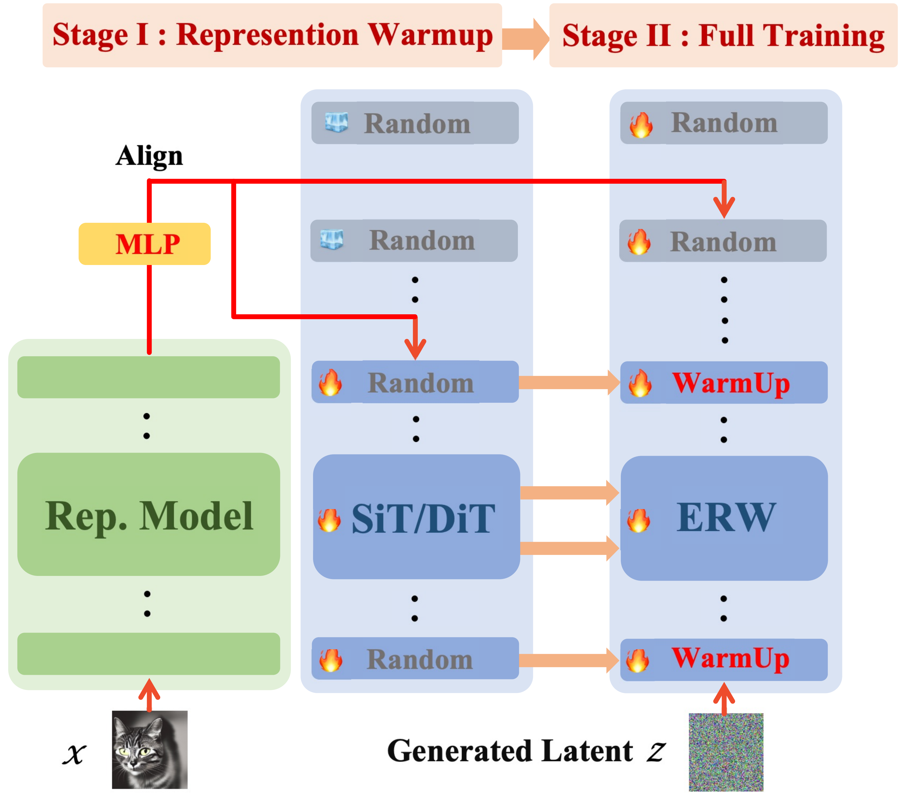
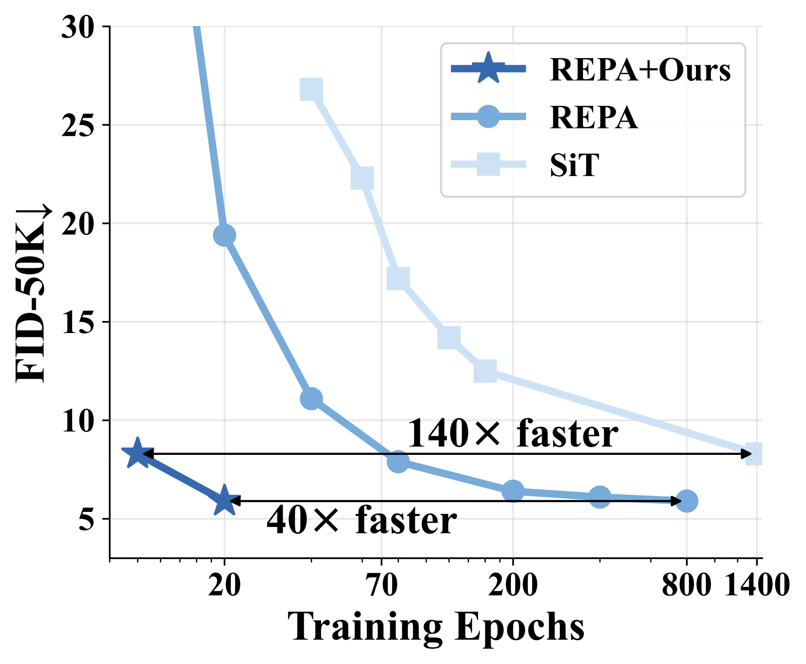

<h1 align="center"> Efficient Generative Model Training via Embedded Representation Warmup
</h1>

<a href="https://arxiv.org/abs/2410.10629"></a> &ensp;
<a href="https://nvlabs.github.io/Sana/"></a> &ensp;

<div align="center">
  <a href="https://sempraety.github.io/DeyuanLiu.github.io/" target="_blank">Deyuan&nbsp;Liu</a><sup>1,2*</sup> &ensp; <b>&middot;</b> &ensp;
  <a href="https://sp12138.github.io/" target="_blank">Peng&nbsp;Sun</a><sup>1,3*</sup> &ensp; <b>&middot;</b> &ensp;
  <a href="#" target="_blank">Xufeng&nbsp;Li</a><sup>1,4</sup> &ensp; <b>&middot;</b> &ensp;
  <a href="https://tlin-taolin.github.io/" target="_blank">Tao&nbsp;Lin</a><sup>1†</sup>
  <br>
  <sup>1</sup> Westlake University &emsp;
  <sup>3</sup> Zhejiang University &emsp;
  <sup>4</sup> Nanjing University
  <br>
  * These authors contributed equally. &emsp; † Corresponding author.
</div>
<h3 align="center">[<a href="http://arxiv.org/abs/2410.06940">arXiv</a>] [<a href="http://arxiv.org/abs/2410.06940">Project Page</a>]</h3>

<div style="display: flex; justify-content: center; align-items: center; gap: 20px;">
  
  
  
</div>

<b>Summary</b>: 
Diffusion models have made impressive progress in generating high-fidelity images. However, training them from scratch requires learning both robust semantic representations and the generative process simultaneously. Our work introduces Embedded Representation Warmup (ERW) – a plug-and-play two-phase training framework that:

- Phase 1 – Warmup: Initializes the early layers of the diffusion model with high-quality, pretrained visual representations (e.g., from DINOv2 or other self-supervised encoders). 
- Phase 2 – Full Training: Continues with standard diffusion training while gradually reducing the alignment loss, so the model can focus on refining generation.

## 🔥 News

- (🔥 New) \[2025/4/15\] 🔥**RW-1.5 code & weights are released!** 🎉 Include: Training & Inference code and [Weights in HF](asset/docs/model_zoo.md) are all released.

### 1. Environment setup

```bash
conda create -n erw python=3.9 -y
conda activate erw
pip install -r requirements.txt
```

### 2. Dataset

#### Dataset download

Currently, we provide experiments for [ImageNet](https://www.kaggle.com/competitions/imagenet-object-localization-challenge/data). You can place the data that you want and can specifiy it via `--data-dir` arguments in training scripts. Please refer to REPA [preprocessing guide](https://github.com/sihyun-yu/REPA/tree/master/preprocessing).

#### Process 1n1k to Latent

```bash
python extract_latent.py \
  --data-path=[YOUR_DATA_PATH] \
  --output-dir==[YOUR_DATA_OUTPUT_PATH]
```

#### Warmuped Checkpoint

[Weights for 100K Warmuped](asset/docs/model_zoo.md)

[Weights for 100K Warmuped + 200K Full Training (With QK-Norm)](asset/docs/model_zoo.md)

[Weights for 100K Warmuped + 200K Full Training (Without QK-Norm)](asset/docs/model_zoo.md)

### 3. Training

Training from Scartch

```bash
accelerate launch train.py \
  --report-to="wandb" \
  --allow-tf32 \
  --mixed-precision="fp16" \
  --seed=0 \
  --path-type="linear" \
  --prediction="v" \
  --weighting="uniform" \
  --model="SiT-XL/2" \
  --enc-type="dinov2-vit-b" \
  --encoder-depth=14 \
  --output-dir="exps" \
  --exp-name="erw-linear-dinov2-b-enc14" \
  --max-train-steps 300000 \
  --checkpointing-steps 50000 \
  --warmup-steps 100000 \
  --use_rope \
  --data-dir=[YOUR_DATA_PATH]
```

Resume Our warmed up checkpoint
```bash
accelerate launch train.py \
  --report-to="wandb" \
  --allow-tf32 \
  --mixed-precision="fp16" \
  --seed=0 \
  --path-type="linear" \
  --prediction="v" \
  --weighting="uniform" \
  --model="SiT-XL/2" \
  --enc-type="dinov2-vit-b" \
  --encoder-depth=14 \
  --output-dir="exps" \
  --exp-name="erw-linear-dinov2-b-enc14" \
  --max-train-steps 300000 \
  --checkpointing-steps 50000 \
  --warmup-steps 100000 \
  --resume-step 100000 \
  --use_rope \
  --data-dir=[YOUR_DATA_PATH]
```


Then this script will automatically create the folder in `exps` to save logs and checkpoints. You can adjust the following options:

- `--models`: `[SiT-B/2, SiT-L/2, SiT-XL/2]`
- `--enc-type`: `[dinov2-vit-b, dinov2-vit-l, dinov2-vit-g, dinov1-vit-b, mocov3-vit-b, , mocov3-vit-l, clip-vit-L, jepa-vit-h, mae-vit-l]`
- `--encoder-depth`: Any values between 1 to the depth of the model
- `--output-dir`: Any directory that you want to save checkpoints and logs
- `--exp-name`: Any string name (the folder will be created under `output-dir`)

For DINOv2 models, it will be automatically downloaded from `torch.hub`. For CLIP models, it will be also automatically downloaded from the CLIP repository. For other pretrained visual encoders, please download the model weights from the below links and place into the following directories with these names:

- `mocov3`: Download the ViT-B/16 or ViT-L/16 model from the [`RCG`](https://github.com/LTH14/rcg) repository and place them as `./ckpts/mocov3_vitb.pth` or `./ckpts/mocov3_vitl.pth`


### 4. Evaluation

You can generate images (and the .npz file can be used for [ADM evaluation](https://github.com/openai/guided-diffusion/tree/main/evaluations) suite) through the following script:

```bash
torchrun --nnodes=1 --nproc_per_node=8 inference.py \
  --model SiT-XL/2 \
  --num-fid-samples 50000 \
  --ckpt YOUR_CHECKPOINT_PATH \
  --path-type=linear \
  --encoder-depth=14 \
  --projector-embed-dims=768 \
  --per-proc-batch-size=64 \
  --mode=sde \
  --num-steps=250 \
  --cfg-scale=1.0 \
  --use_rope \
  --fid-reference YOUR_VIRTUAL_imagenet256_labeled.npz_PATH
```

w/ CFG

```bash
torchrun --nnodes=1 --nproc_per_node=8 inference.py \
  --model SiT-XL/2 \
  --num-fid-samples 50000 \
  --ckpt YOUR_CHECKPOINT_PATH \
  --path-type=linear \
  --encoder-depth=14 \
  --projector-embed-dims=768 \
  --per-proc-batch-size=64 \
  --mode=sde \
  --num-steps=250 \
  --cfg-scale=2.2 \
  --guidance-high=0.95 \
  --use_rope \
  --fid-reference YOUR_VIRTUAL_imagenet256_labeled.npz_PATH
```

We also provide the SiT-XL/2 checkpoint (trained for 4M iterations) used in the final evaluation. It will be automatically downloaded if you do not specify `--ckpt`.

### 4. CKNNA 

tools/extract_fecture.py

### Note

It's possible that this code may not accurately replicate the results outlined in the paper due to potential human errors during the preparation and cleaning of the code for release. If you encounter any difficulties in reproducing our findings, please don't hesitate to inform us. Additionally, we'll make an effort to carry out sanity-check experiments in the near future.

## Acknowledgement

This code is mainly built upon [REPA](https://github.com/sihyun-yu/REPA), [LightningDiT](https://github.com/hustvl/LightningDiT/), [DiT](https://github.com/facebookresearch/DiT), [SiT](https://github.com/willisma/SiT), [edm2](https://github.com/NVlabs/edm2), and [RCG](https://github.com/LTH14/rcg) repositories.

## BibTeX

```bibtex
@inproceedings{yu2025repa,
  title={Representation Alignment for Generation: Training Diffusion Transformers Is Easier Than You Think},
  author={Sihyun Yu and Sangkyung Kwak and Huiwon Jang and Jongheon Jeong and Jonathan Huang and Jinwoo Shin and Saining Xie},
  year={2025},
  booktitle={International Conference on Learning Representations},
}
```
